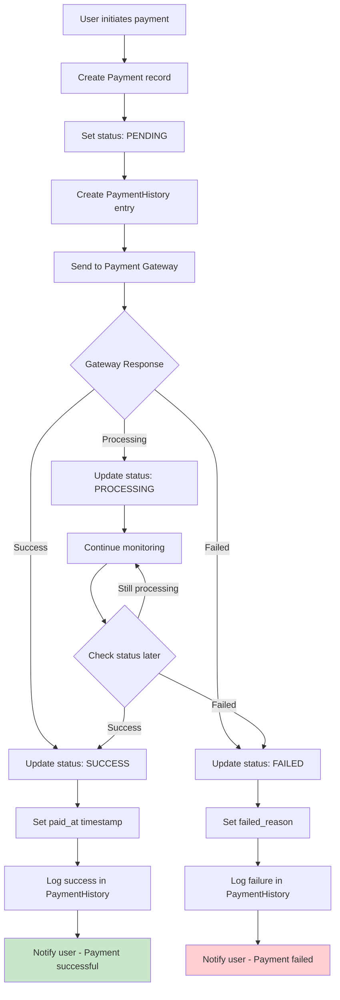

# Ecommerce_AlpineJS
## Database diagram
The web's database is [here](https://dbdiagram.io/d/ECommerce-686600daf413ba350809670b)

```mermaid
flowchart TD
    A[User initiates payment] --> B[Create Payment record]
    B --> C[Set status: PENDING]
    C --> D[Create PaymentHistory entry]
    D --> E[Send to Payment Gateway]
    
    E --> F{Gateway Response}
    F -->|Success| G[Update status: SUCCESS]
    F -->|Failed| H[Update status: FAILED]
    F -->|Processing| I[Update status: PROCESSING]
    
    G --> J[Set paid_at timestamp]
    J --> K[Log success in PaymentHistory]
    K --> L[Notify user - Payment successful]
    
    H --> M[Set failed_reason]
    M --> N[Log failure in PaymentHistory]
    N --> O[Notify user - Payment failed]
    
    I --> P[Continue monitoring]
    P --> Q{Check status later}
    Q -->|Success| G
    Q -->|Failed| H
    Q -->|Still processing| P
    
    style L fill:#c8e6c9
    style O fill:#ffcdd2
```